# Peridot
*A nova rede social para compartilhar seus gostos*

 

## Descrição do Projeto

**Peridot** é uma rede social completa, desenvolvida com uma API back-end em **Django Rest Framework (DRF)** e um front-end moderno construído com **React** e **Styled-Components**.

O projeto nasceu com o objetivo acadêmico de ser um clone simplificado do Twitter, mas evoluiu com a adição de funcionalidades extras para aprimorar a experiência do usuário. Hoje, a Peridot é uma plataforma funcional onde diversos usuários já interagem entre si.

 

## Funcionalidades

A plataforma oferece uma experiência completa de rede social, incluindo:

### Autenticação e Contas
* Sistema seguro de cadastro e login de usuários.

### Gerenciamento de Perfil
* Customização de foto de perfil (incluindo GIFs), nome e senha.
* Visualização da lista de postagens feitas pelo usuário em seu próprio perfil.

### Feed e Socialização
* Sistema para seguir e deixar de seguir outros usuários.
* Visualização da lista de seguidores e de quem o usuário segue.
* Feed de notícias cronológico que exibe apenas as postagens dos usuários seguidos.

### Postagens e Interações
* Criação de postagens com texto, imagens e GIFs.
* Possibilidade de curtir e comentar nas publicações de outros usuários.

### Busca e Descoberta
* Ferramenta de pesquisa para encontrar usuários e postagens específicas.

### Design Responsivo
* Interface totalmente adaptável para uma experiência consistente em desktops, tablets e celulares.

 

## Objetivo do Projeto

O desenvolvimento deste projeto teve como finalidade principal aplicar e consolidar os conhecimentos adquiridos durante minha jornada no curso **Desenvolvedor Fullstack Python** da EBAC.

 

## Tecnologias Utilizadas

O projeto foi construído com as seguintes tecnologias e ferramentas:

### Front-end
* **Linguagem:** TypeScript
* **Biblioteca:** React
* **Estilização:** Styled Components
* **Qualidade de Código:** ESLint e Prettier para padronização e linting.
* **Gerenciador de Pacotes:** npm

### Back-end
* **Framework:** Django e Django Rest Framework (DRF)
* **Banco de Dados:** MySQL

 

## Deploy

A aplicação está no ar e pode ser acessada através dos seguintes links:

* **Front-end (Vercel):**  [https://peridot-smoky.vercel.app/]
* **Back-end (PythonAnywhere):** [https://georgebks.pythonanywhere.com/api/]

 

## Tutorial
* **Ao entrar no site essa vai ser a primeira página que irá visualizar:**
  
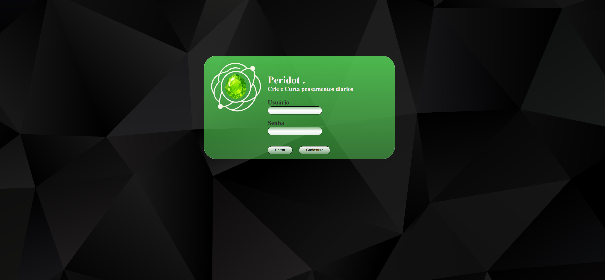

* **Clique em 'Cadastrar' e será redirecionado para a página de cadastro. Preencha os dados seguindo o formulário corretamente:**
  
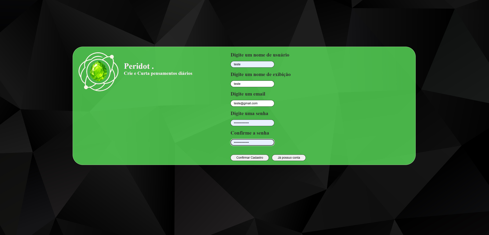

* **Após realizar o cadastro com sucesso, será redirecionado para a página de login novamente (caso não consiga realizar o login atualize a página atual e tente logar novamente).**

   
  
* **Com o login realizado, irá ser redirecionado para o seu feed inicial.**
  
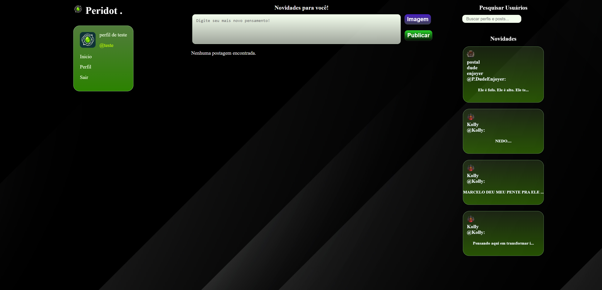

* **Como sua conta é nova e não segue nenhum usuário, os unicos posts disponiveis são os de sugestão (últimos posts enviados por usuários diversos).**

  
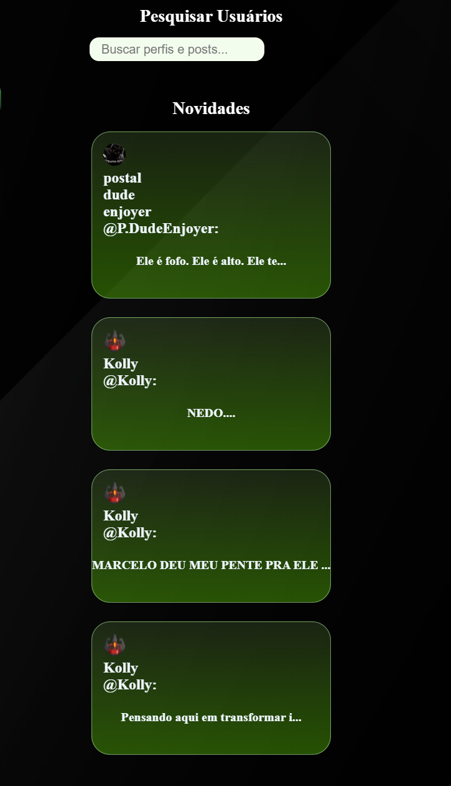

   

* **Clicando no input central ao topo da tela você pode digitar seus Posts:**
  
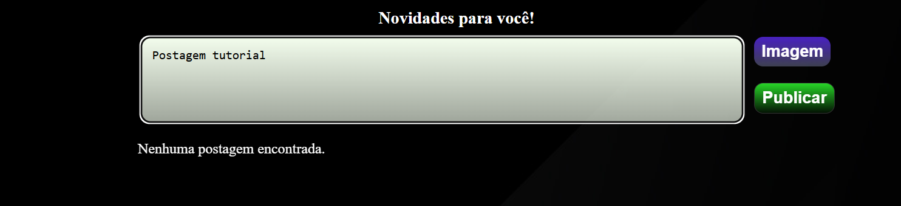

* **Caso deseje, é possivel atribuir uma imagem ou gif na sua postagem:**
  
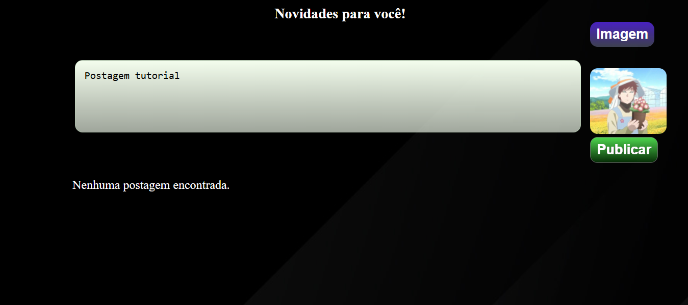

* **Clicando em "Postar" você realiza sua postagem, irá aparecer em tempo real no seu feed**
* (ao atualizar sua página é possivel ver sua postagem nas novidades sugeridas, onde aparece para todos os usuários, incluindo os que não te seguem)
  
  
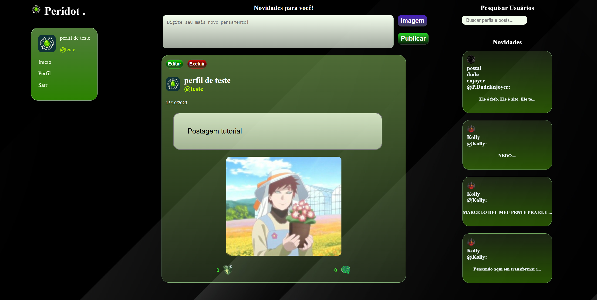

* **Clicando no Input de pesquisa, é possivel procurar por usuários e posts, ao clicar em um usuário é redirecionado para o perfil do mesmo**
* a pesquisa ativa a partir do segundo caractere automaticamente, os resultados são listados permitindo scroll.

  
* Resultado de usuários:
  
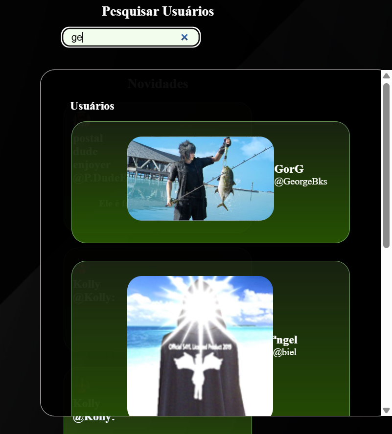

 
* Resultado de postagens:

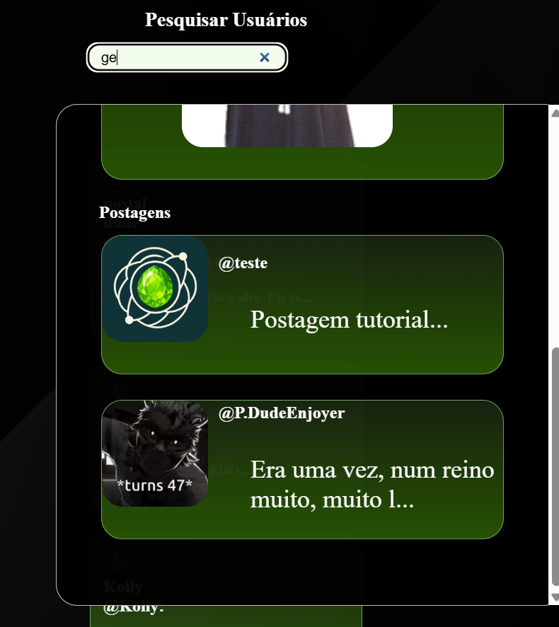

 

* **Ao entrar no perfil de um usuário, você verá a opção de segui-lo (ou deixar de seguir caso já esteja seguindo):**

* normal:
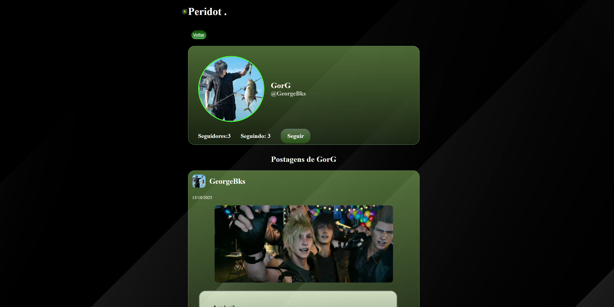

* seguindo:
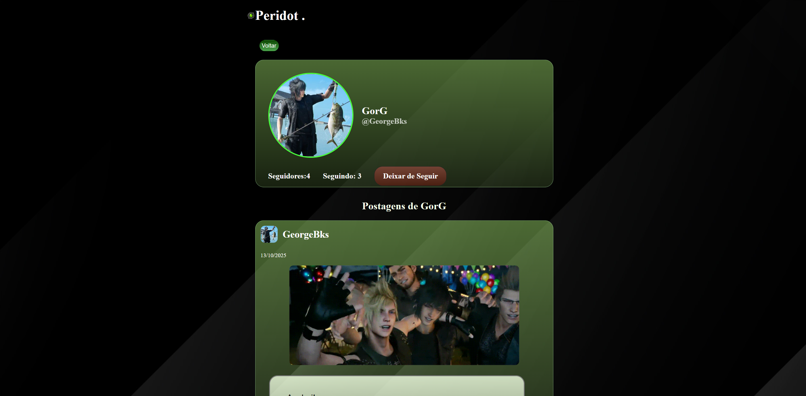

 

* **É possivel ver a lista de seguidores e seguindo no perfil do usuário:**
* Também é possivel entrar no perfil dos usuários listados 

* Lista de seguidores:
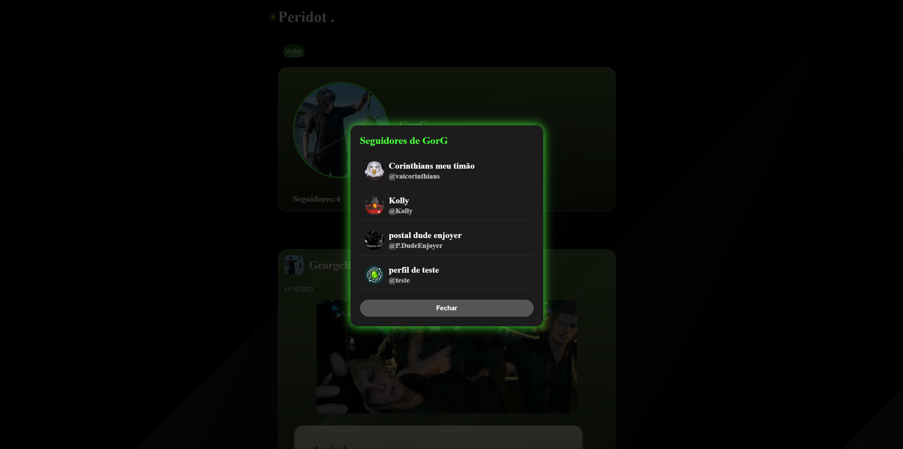

* Lista de seguindo:
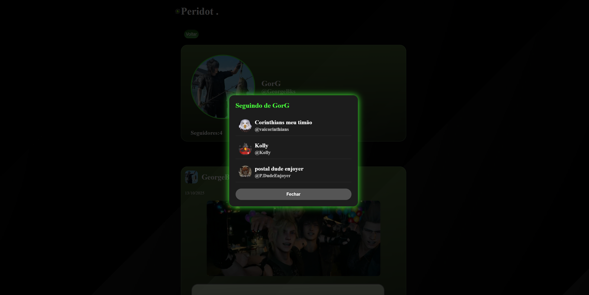

* o perfil de cada usuário contém um feed com todos os posts feitos por ele:
* é possivel interagir com os posts de dentro do pefil do usuário e no feed

* as formas de interagir são dando like:
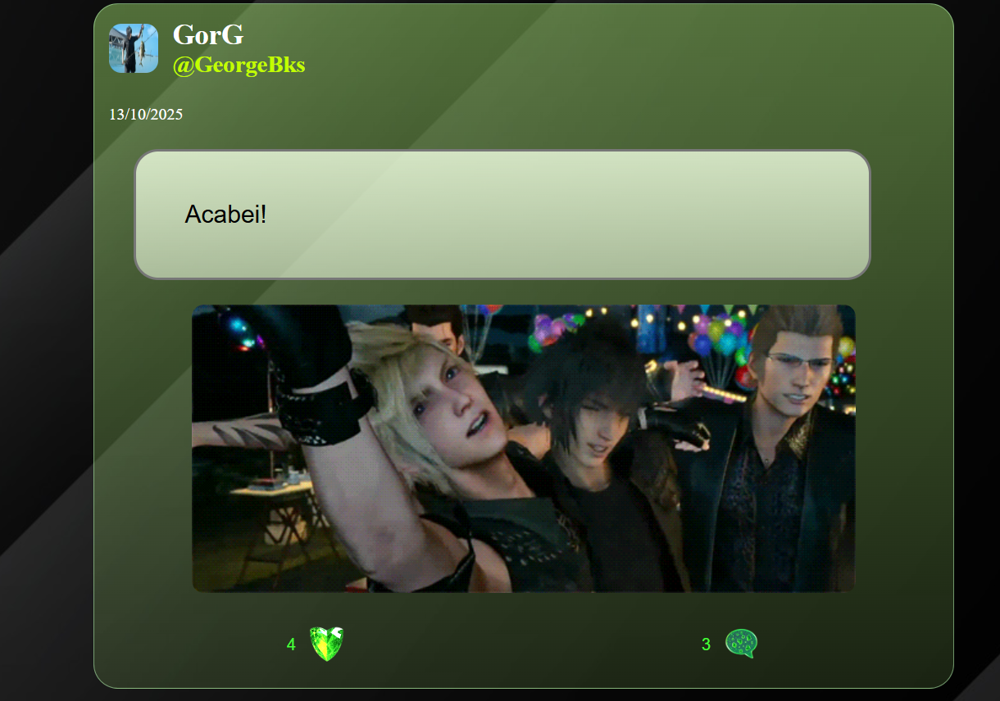

* e comentando:
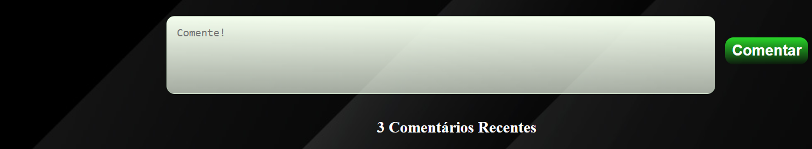

* **O Peridot permite que você veja e edite o seu perfil desde o nome de exibição até senha**
** no lugar de 'seguir'/'deixar de seguir', quando é o seu próprio perfil irá aparecer a opção 'Editar Perfil' no mesmo local
  
* editando nome de perfil:
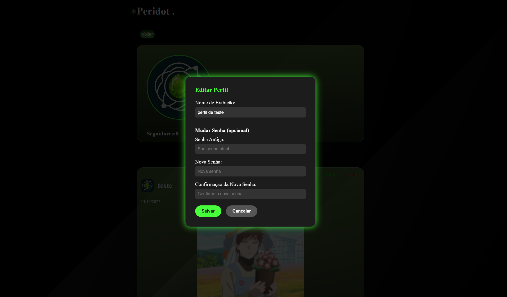

* nome editado:
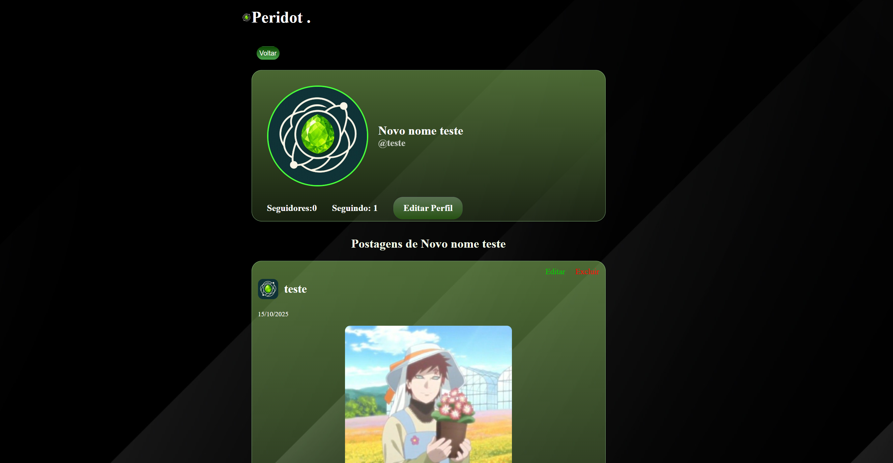

*(Após edição, quando atualizar sua página verá que seu nome já está editado em todos os campos disponiveis no site)

* ** Editando foto de perfil **
  
* lembrando que sua imagem de perfil pode ser um gif para ficar mais estilizado!

* para mudar a imagem de perfil clique na foto atual que abrirá o seletor de imagens do seu dispositivo.

*seja criativo e deixe com um estilo que você goste!

*antes de mudar a foto de perfil (placeholder):
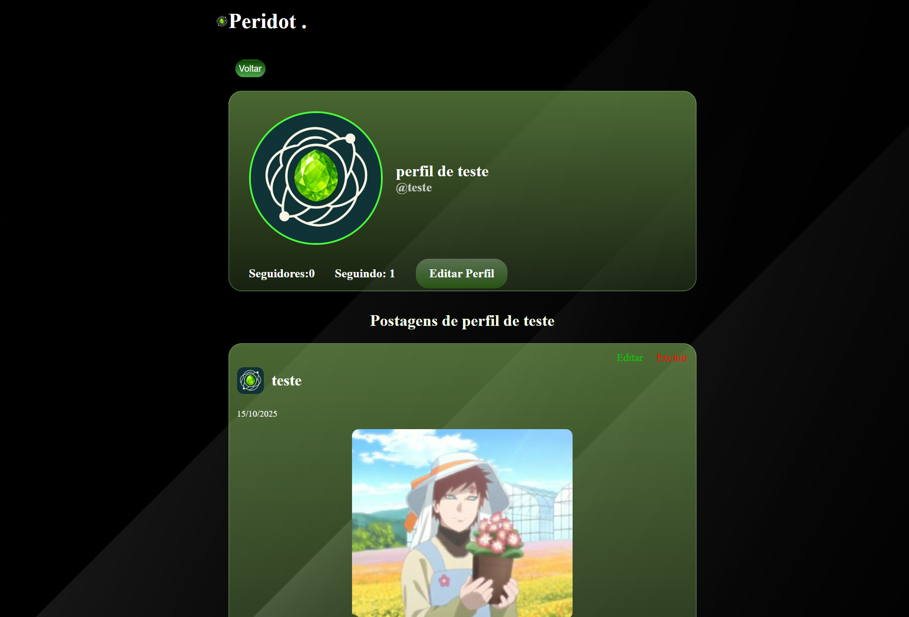

*após edição:

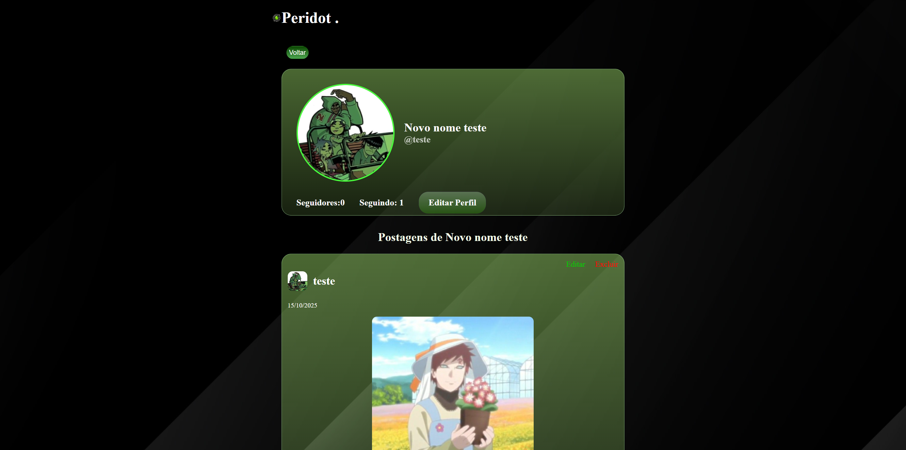
